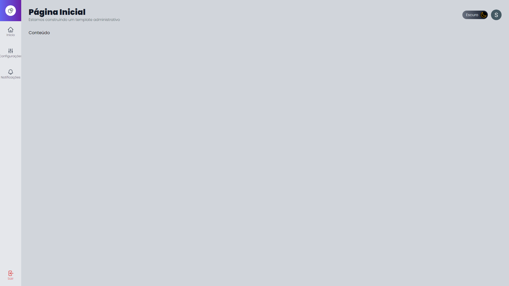
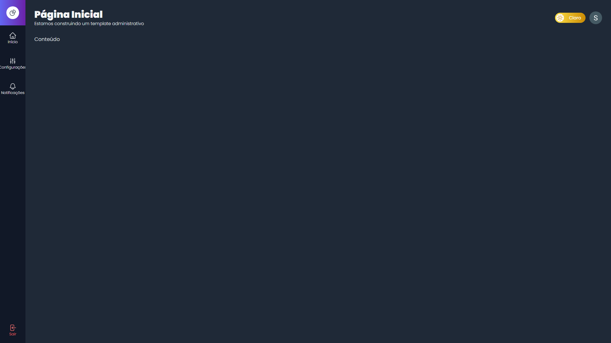

# ADMIN TEMPLATE

"Admin Template" é, como o próprio nome sugere, um template administrativo de um sistema. Totalmente personalizável, se adequa a vários contextos.

 

## 📃 Funcionalidades (Visuais e Técnicas)

Apesar de ser totalmente customizável, por padrão, vem com algumas funcionalidades. Entre elas:

<ul>
  <li>Login e cadastro de usuários;</li>
  <li>Tela de Login customizada;</li>
  <li>Alteração de tema (light/dark);</li>
  <li>Cookies de autenticação;</li>
  <li>Persistência dos dados.</li>
   
</ul>

## 📚 Tecnologias utilizadas

<ul>
  <li>NextJS</li>
  <li>Typescript</li>
  <li>Tailwind CSS</li>
  <li>Firebase</li>
  <li>entre outras...</li>
</ul>

 

## ☁ Visualizar o Projeto

Basta acessar clicar <a href="https://admin-template-xi.vercel.app/">aqui</a>.

 

## Fotos

 

Tela de Login / Cadastro

 

Tela Principal (modo light)

 

Tela Principal (modo dark)

